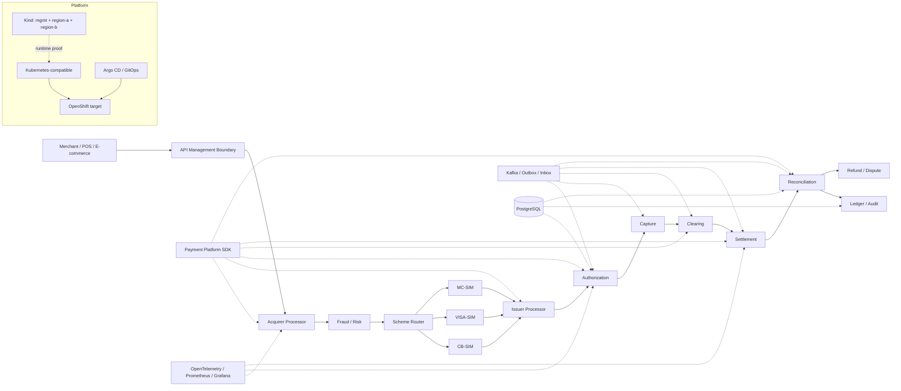
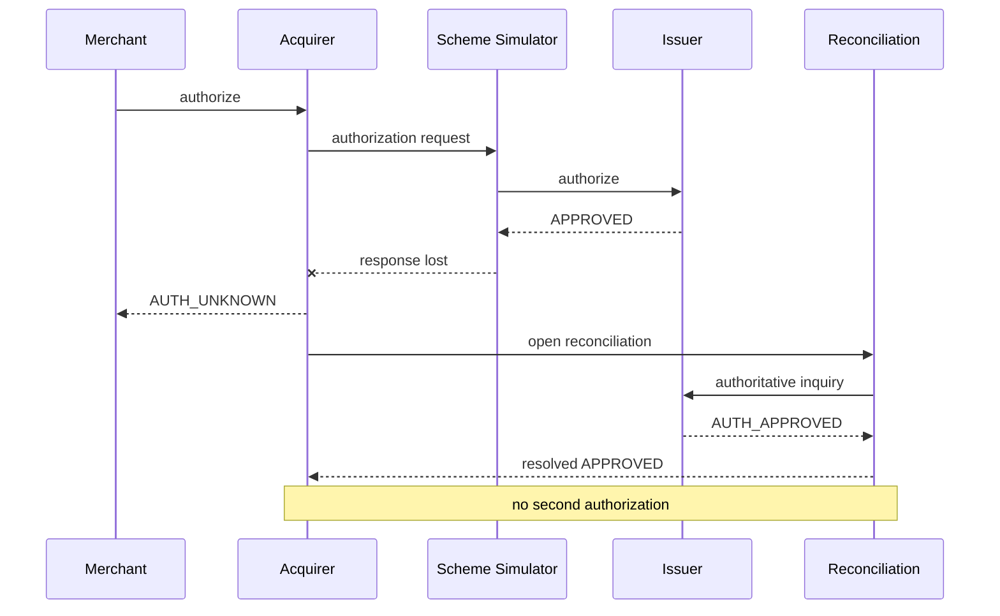

# A3 Final Architecture — European Payment Processing Reference Platform

**Format intent:** one-page landscape architecture board for interview/demo use.

## Main message

**Correctness before scale — architecture evidence before claims.**



## Critical failure path



## Runtime evidence panel

- Payment API E2E — **PASS**
- Kafka produce/consume — **PASS**
- PostgreSQL financial constraints — **PASS**
- Kind 3-cluster region-loss test — **PASS**
- Docker/Kustomize platform CI — **PASS**
- Java build/tests — **PASS**

## Claim boundary panel

**Runtime-proven**
- payment API E2E;
- Kafka single-node;
- PostgreSQL constraints;
- local synthetic multi-cluster;
- application Prometheus endpoint.

**Reference/configured**
- OpenShift live deployment;
- Keycloak;
- Gravitee;
- external Prometheus/Grafana/OTel stack;
- Kafka HA;
- PostgreSQL HA;
- IBM Cloud;
- Axway.

## Wero boundary

```text
CARD:
Merchant -> Acquirer -> Scheme -> Issuer

WERO:
User/Merchant -> Wero/EPI boundary -> SCT Inst -> PSP/Bank
```

Wero is not modelled as a card scheme.
